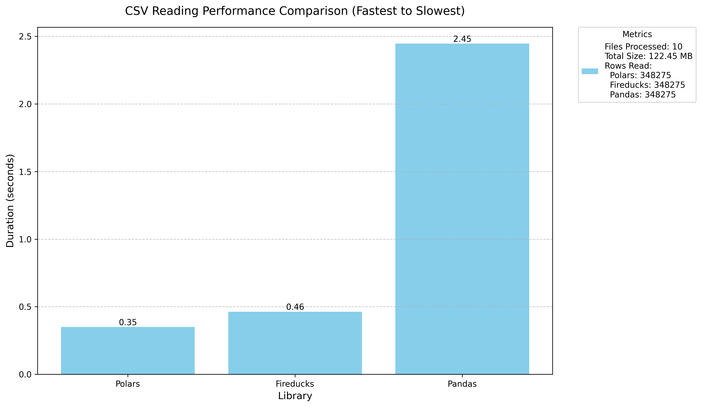

# 🚀 Performance Test: Polars vs. FireDucks vs. Pandas

## 📌 Overview
This repository compares the performance of **Polars**, **FireDucks**, and **Pandas** when handling Excel-to-CSV transformations. It measures execution time and visualizes the results in a simple bar chart.

## ✅ Features
- 🔄 Converts Excel files (`.xlsx`) to CSV using `xlsx_to_csv.py`
- ⚡ Benchmarks the speed of Polars, FireDucks, and Pandas
- 📦 Uses `pyproject.toml` to manage dependencies with `uv`
- 📊 Generates a bar chart showing execution time comparisons using `generate_graphics.py`

## 🖥️ System Specs
- **Processor:** AMD Ryzen 5
- **RAM:** 16GB

## 📥 Installation
Ensure you have `uv` installed. Then, install dependencies using:
```bash
uv install
```
This will install all dependencies listed in `pyproject.toml`.

Create folder 'excel_files' with your excel files within.

## ▶️ Usage
Run the performance test script:
```bash
uv run python xlsx_to_csv.py
uv run python main.py
uv run python generate_graphics.py
```
The steps:
1. 🔄 `xlsx_to_csv.py` -> Convert `.xlsx` files to `.csv`.
2. ⏱️ `main.py` -> Measure processing times of Polars, FireDucks, and Pandas.
3. 📊 `generate_graphics.py` -> Generate a bar chart with the results.

## 📊 Results
The benchmark outputs a simple bar chart comparing the time taken by each library.


